<h1>Emre Eroğlu</h1>

<b>Computer Engineer · AI &amp; Backend Software Engineer</b> Python · FastAPI · LLMs · Cloud

  

  
<table>
  <tr>
    <td valign="top"></td>
    <td valign="top"></td>
  </tr>
</table>

 

  **Languages & Frameworks**

  &nbsp;
  &nbsp;
  &nbsp;
  &nbsp;
  &nbsp;
  &nbsp;
  &nbsp;
  &nbsp;
  &nbsp;
  

  **Mobile & Backend**

  &nbsp;
  &nbsp;
  &nbsp;
  &nbsp;
  &nbsp;
  &nbsp;
  &nbsp;
  &nbsp;

  **AI & Machine Learning**

  &nbsp;
  &nbsp;
  

  **Tools & Platforms**

  &nbsp;
  &nbsp;
  &nbsp;
  &nbsp;
  &nbsp;
  &nbsp;
  &nbsp;
  &nbsp;

 

